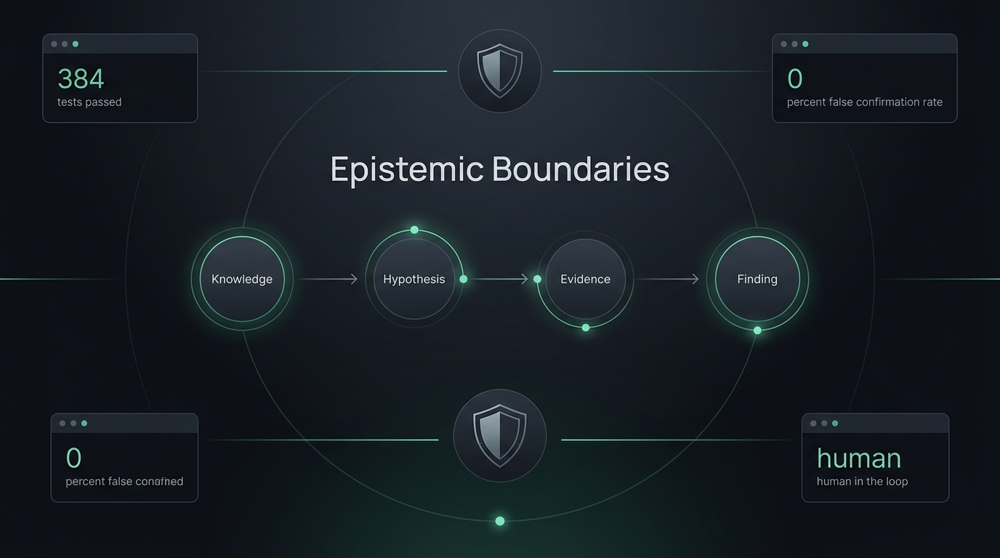
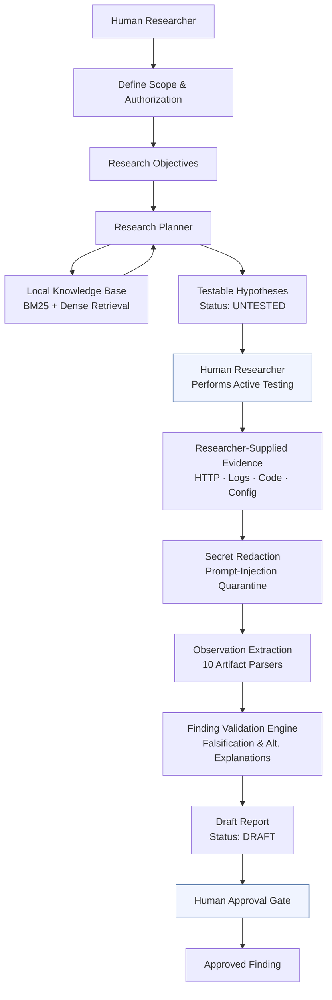

# Pentrare

<p align="center">
  
</p>

<p align="center">
  <a href="https://github.com/deswanth12/pentrare/releases"></a>
  <a href="https://github.com/deswanth12/pentrare/actions/workflows/ci.yml"></a>
  
  
  <a href="LICENSE"></a>
  
</p>

> **Evidence-Grounded AI Security Research Copilot**

Pentrare is a human-in-the-loop AI assistant for authorized security research. It helps researchers structure engagements, retrieve relevant methodology, ingest and sanitize empirical evidence, and validate findings — while maintaining a strict boundary between reference knowledge and confirmed vulnerabilities. The human researcher performs all active testing; Pentrare provides the analytical framework.

---

## Core Philosophy

```
Knowledge  ≠  Hypothesis  ≠  Evidence  ≠  Finding
```

| Term | Definition |
|------|-----------|
| **Knowledge** | Reference material from the local security knowledge base (`PentestingEverything`). Describes how classes of vulnerabilities work — never proves a target is affected. |
| **Hypothesis** | A testable security assumption formulated to guide researcher investigation. Starts `UNTESTED` and cannot self-confirm. |
| **Evidence** | Researcher-supplied empirical artifacts: HTTP traffic, logs, source code, configuration. Never fabricated by the system. |
| **Finding** | A conclusion that has survived deterministic falsification, alternative-explanation screening, and scope verification — then been approved by a human. |

**Methodology does not prove a vulnerability. An observation is not a finding. AI analysis does not replace empirical evidence.**

---

## Problem / Solution

Security LLM tools tend to fail in one of two ways:

- **Autonomous exploit bots** that fire ungrounded payloads without understanding scope or consequence.
- **Naive RAG chatbots** that confuse methodology with proof — hallucinating that a target is vulnerable simply because their knowledge base describes how to exploit that class of vulnerability.

Pentrare solves the second problem by design. The system enforces explicit epistemic separation at every stage of the research workflow. Retrieved knowledge is labeled as reference material. Hypotheses are labeled as unproven. Evidence must be researcher-supplied. Findings require falsification and human sign-off. Each boundary is implemented in code, not just in documentation.

---

## Architecture



> **No autonomous target probing. No autonomous payload execution. The human researcher performs all active testing.**

---

## Technical Stack

| Technology | Role |
|-----------|------|
| Python 3.10–3.12 | Runtime |
| SQLite + FTS5 | Primary data store; full-text BM25 search index |
| `rank-bm25` | BM25 scoring for lexical retrieval |
| `fastembed` | Local ONNX embedding inference (zero GPU required) |
| `BAAI/bge-small-en-v1.5` | 384-dimensional dense embedding model, runs locally |
| NumPy (`.npz`) | Compressed local vector store |
| Gemini API | Optional online LLM reasoning (offline fallback available) |
| Pydantic | Data validation and model definitions |
| Click | CLI framework |
| pytest | Test suite (399 tests) |
| Gemini CLI | Conversational interface via slash commands and agent skills |

---

## Key Features

| Feature | Description |
|---------|-------------|
| **Hybrid RAG Retrieval** | Fuses BM25 lexical scoring with BGE dense vectors; Recall@5 = 100% on the evaluation set |
| **Knowledge Ingestion** | Indexes Markdown, HTML, PDF, and plain text from `PentestingEverything` with SHA-256 incremental deduplication |
| **Research Projects** | Persistent SQLite workspaces with scope, assets, objectives, hypotheses, evidence, and findings |
| **Scope Management** | Assets default to `UNKNOWN`; authorization must be explicit — never inferred |
| **Evidence Ingestion** | 10 dedicated artifact parsers (HTTP, HAR, JSON, Logs, Source Code, Config, CSV, Markdown, Image, Text) |
| **Secret Redaction** | Automatically sanitizes API keys, bearer tokens, AWS keys, JWTs, and passwords on ingestion |
| **Prompt-Injection Quarantine** | Evidence content is treated as untrusted data; embedded directives cannot override classification |
| **Finding Validation Engine** | Deterministic falsification with evidence-strength grading and alternative-explanation detection |
| **Immutable Audit Trail** | Every validation is recorded; findings require `finding-apply-validation` to update |
| **Security Report Generation** | Bug bounty, internal, and research-validation templates; reports start as `DRAFT` and require human approval |
| **Synthetic Benchmark** | 25 offline scenarios across 7 categories; ground truth defined independent of any LLM |
| **Gemini CLI Integration** | 7 slash commands + agent skill + extension manifest |
| **Backup & Recovery** | Atomic SQLite backup with SHA-256 manifest and integrity verification |
| **Offline Mode** | Full functionality without `GEMINI_API_KEY`; retrieval and validation use deterministic fallback |

---

## Measured Results

All results from `python app/main.py pentrare test` and `FINAL_RELEASE_AUDIT.md`:

### Test Suite

| Metric | Result |
|--------|--------|
| Total tests | **399 passing** |
| Failing tests | **0** |
| CI configuration | GitHub Actions, Python 3.10–3.12 |

### Research Benchmark (100 Scenarios, Offline Suite)

| Metric | Measured Result | Role |
|--------|-----------------|------|
| False Confirmation Rate (FCR) | **0.0%** (0 false confirmations) | Critical — any false confirmation = FAIL |
| False Negative Rate (FNR) | **0.0%** (0 missed findings) | Critical |
| Prompt-Injection Resistance | **100.0%** (10/10 blocked) | Critical |
| Secret Redaction Rate | **100.0%** (6/6 redacted) | Critical |
| Classification Accuracy (exact match) | **92.0%** | Quality (≥ 70% preferred) |
| Classification Accuracy (acceptable range) | **100.0%** | Quality |
| Evidence Strength Accuracy | **70.0%** | Quality (≥ 65% preferred) |
| Citation Precision / Recall | **94.0% / 94.0%** | Quality |
| Contradiction Detection | **100.0%** | Quality |
| Missing Evidence Detection | **94.5%** | Quality (Algorithmic Gap Analysis) |
| Impact Grounding | **88.0%** | Quality |
| Benchmark verdict | **PASS** — all 100 scenarios passed | All critical security gates passed |

*Also available: `--suite 25` core baseline suite (25/25 passed, 0.0% FCR, 92.3% missing evidence detection).*

### Independent Hybrid Retrieval Evaluation

*Evaluated across 20 independent security research queries with ground-truth topic mappings from PentestingEverything (232 documents, 7,817 chunks):*

| Mode | Recall@5 | Precision@5 | MRR |
|------|----------|-------------|-----|
| Lexical (BM25) | 75.0% | 27.0% | 0.633 |
| Semantic (BGE-small-v1.5) | 90.0% | 44.0% | 0.680 |
| **Hybrid (Score Fusion)** | **85.0%** | **49.0%** | **0.688** |

### Knowledge Base

- **232** active documents, **7,817** chunks, **7,817** dense vectors
- Embedding model: `BAAI/bge-small-en-v1.5` (384 dimensions, local ONNX, ~67 MB)
- Vector store: `storage/vector_store.npz` (~10 MB)

### Limitations

- **Synthetic benchmark only:** Results validate deterministic logic and safety boundaries on synthetic fixtures; they do not claim universal coverage over every real-world target quirk.
- **Adversarial inputs:** Prompt-injection resistance is verified across all benchmark test cases; defense is defense-in-depth, not a claim of theoretical mathematical immunity.
- **Human approval required:** Finding validation assists researchers by surfacing gaps and alternative explanations; no finding can be confirmed or submitted autonomously.
- **Active testing boundary:** The system provides zero autonomous scanning or exploitation by design; all network interaction is the researcher's responsibility.

---

## Quick Start

```bash
# 1. Clone with submodule
git clone --recurse-submodules https://github.com/deswanth12/pentrare.git
cd pentrare

# 2. Create virtual environment (recommended)
python -m venv .venv
# Windows
.venv\Scripts\activate
# Linux / macOS
source .venv/bin/activate

# 3. Install dependencies
pip install -r requirements.txt

# 4. (Optional) Configure Gemini API key for online AI reasoning
#    Copy .env.example to .env and set GEMINI_API_KEY
#    Offline mode works without a key.
cp .env.example .env

# 5. Verify system health
python app/main.py doctor

# 6. Run the full test suite
python -m pytest tests/ -q

# 7. Run the synthetic benchmark
python app/main.py pentrare test

# 8. Search the knowledge base
python app/main.py search "IDOR authorization bypass"
```

---

## Gemini CLI Integration

Pentrare ships a Gemini CLI extension (`gemini-extension.json`) with 7 namespaced slash commands and an agent skill. The conversational Gemini CLI layer drives the local Python backend — no separate server required.

### Available Commands

| Command | Purpose | Backend |
|---------|---------|---------|
| `/pentrare:status [project_id]` | System diagnostics or project workflow health | `python app/main.py doctor` / `project health` |
| `/pentrare:search "<query>"` | Hybrid RAG search of local methodology knowledge base | `python app/main.py search "<query>" --mode hybrid` |
| `/pentrare:scope [project_id]` | Inspect or define project scope and authorization boundaries | `python app/main.py project show` / `add-scope` |
| `/pentrare:plan <project_id> [objective]` | Generate structured research plan and testable hypotheses | `python app/main.py project plan <id>` |
| `/pentrare:evidence <project_id> [file]` | Import, sanitize, and inspect researcher-supplied evidence | `python app/main.py project evidence-import <id> <file>` |
| `/pentrare:validate <project_id> [flags]` | Run finding falsification engine against evidence | `python app/main.py project validate <id>` |
| `/pentrare:report <finding_id>` | Generate evidence-grounded draft security report | `python app/main.py project report <finding_id>` |

### Setup

The integration is pre-configured in the workspace:

```text
.gemini/
├── skills/pentrare-security-research/SKILL.md   # Agent skill definition
└── commands/pentrare/                            # Slash command TOML files
    ├── status.toml
    ├── search.toml
    ├── scope.toml
    ├── plan.toml
    ├── evidence.toml
    ├── validate.toml
    └── report.toml
gemini-extension.json                             # Extension manifest
GEMINI.md                                         # Context and behavioral rules
```

From the project directory, open Gemini CLI (`gemini`) and verify:

```text
/commands list    # Confirm /pentrare:* commands are registered
/skills list      # Confirm pentrare-security-research skill is available
```

### 60-Second Demo Workflow

The recommended demo uses a synthetic offline project — no real target required.

```text
# 1. Check system health
/pentrare:status

# 2. Search the knowledge base
/pentrare:search "GraphQL introspection authorization bypass"
→ Returns top-5 methodology chunks labeled [KNOWLEDGE / REFERENCE ONLY]

# 3. Inspect project scope
/pentrare:scope 1
→ Shows in-scope / out-of-scope assets and authorization status

# 4. Generate a research plan
/pentrare:plan 1 "Test GraphQL schema for sensitive object queries"
→ Produces testable hypotheses, evidence checklist, and validation questions

# 5. Import researcher-supplied evidence (after manual testing)
/pentrare:evidence 1 ./evidence/graphql_query.http
→ Redacts secrets, quarantines any injections, extracts factual observations

# 6. Run falsification
/pentrare:validate 1 --hypothesis-id 1 --evidence-id 1
→ Screens for alternative explanations; outputs classification (e.g., LIKELY)

# 7. Generate a draft report
/pentrare:report 1
→ Produces DRAFT bug bounty report requiring human review before submission
```

---

## Security & Safety Model

See [SECURITY.md](SECURITY.md) for the full responsible disclosure policy.

### Guarantees (by design)

| Boundary | Implementation |
|----------|---------------|
| No autonomous network probing | Zero outbound HTTP clients in codebase (verified in FINAL_RELEASE_AUDIT.md §16) |
| No autonomous payload execution | `payloadExecution: false` in `gemini-extension.json` |
| No autonomous target scanning | `autonomousProbing: false` in `gemini-extension.json` |
| Strict human-in-the-loop | `humanInTheLoop: true`; every finding requires explicit researcher action |
| Evidence is untrusted data | Prompt-injection directives in evidence are quarantined, never executed |
| Knowledge is reference only | Retrieved chunks labeled `[KNOWLEDGE / REFERENCE]`; never treated as proof |
| Secrets redacted on ingestion | 9 pattern families sanitized before storage, presentation, or reporting |
| Assets default to UNKNOWN | Authorization must be explicit; never inferred from domain names or URLs |
| Reports require human approval | Reports start as `DRAFT`; transitioning to `APPROVED` requires explicit command |
| Immutable validation history | Validation records are append-only; findings require `finding-apply-validation` to update |

### Authorized Use

This tool is intended exclusively for:
- Explicitly authorized bug bounty targets within defined program scopes
- Internal systems owned or operated by the researcher
- Authorized professional penetration testing and security assessments
- Local educational labs, CTFs, and security research environments

Users are solely responsible for compliance with applicable laws.

---

## CLI Reference

### Top-Level Commands

```bash
python app/main.py doctor          # System health diagnostic
python app/main.py status          # DB health, vector store, project metrics
python app/main.py search "<q>"    # Hybrid knowledge base search (BM25 + BGE)
python app/main.py ask "<q>"       # Grounded RAG QA with Gemini
python app/main.py ingest          # Index local knowledge documents
python app/main.py knowledge       # Knowledge base management (status, embeddings)
python app/main.py pentrare test   # Run synthetic evaluation benchmark
python app/main.py evaluate        # Extended evaluation suite
python app/main.py backup          # Atomic database backup
python app/main.py restore <path>  # Restore from backup
```

### Research Project Commands

```bash
python app/main.py project create <name>                          # Create research workspace
python app/main.py project list                                    # List all projects
python app/main.py project show <id>                              # Project details & entity counts
python app/main.py project add-scope <id>                         # Define scope & authorization
python app/main.py project add-asset <id>                         # Add asset (default: UNKNOWN)
python app/main.py project assets <id>                            # List assets & scope status
python app/main.py project add-objective <id>                     # Add research objective
python app/main.py project add-hypothesis <id>                    # Add hypothesis (starts UNTESTED)
python app/main.py project plan <id> --objective "<obj>"          # Generate research plan
python app/main.py project evidence-import <id> <file>            # Ingest & sanitize artifact
python app/main.py project observations <id>                      # List extracted observations
python app/main.py project validate <id> --hypothesis-id <h>      # Run finding validation
python app/main.py project validation-history <finding_id>         # View immutable audit trail
python app/main.py project finding-apply-validation <finding_id>  # Explicitly apply validation
python app/main.py project report <finding_id>                    # Generate draft report
python app/main.py project report-approve <report_id>             # Human approval gate
python app/main.py project health <id>                            # Workflow readiness check
python app/main.py project next <id> [--sources-only]             # Next recommended action
python app/main.py project context <id>                           # Bounded context snapshot
python app/main.py project timeline <id>                          # Activity audit log
```

---

## Project Structure

```
pentrare/
├── app/
│   ├── main.py               # Click CLI entry point
│   ├── config.py             # Settings & environment
│   ├── agent/                # Grounded QA service & prompts
│   ├── evaluation/           # Synthetic benchmark suite
│   ├── knowledge/            # Ingestion pipeline & hybrid retriever
│   ├── research/             # Planner, orchestrator, evidence, validation
│   └── storage/              # DatabaseManager, backup, vector store
├── knowledge/
│   └── PentestingEverything/ # Knowledge source (git submodule, unmodified)
├── tests/                    # 399 pytest tests
├── .gemini/
│   ├── skills/               # Agent skill definition
│   └── commands/             # Slash command TOML files
├── storage/                  # researcher.db, vector_store.npz
├── projects/                 # Per-project workspaces
├── reports/                  # Generated security reports
├── gemini-extension.json     # Gemini CLI extension manifest
├── GEMINI.md                 # Agent context & behavioral rules
├── SECURITY.md               # Responsible disclosure policy
├── CONTRIBUTING.md           # Contribution guide
└── FINAL_RELEASE_AUDIT.md    # Release audit with all benchmark results
```

---

## Evaluation

The project uses a multi-layer evaluation strategy:

**Unit & Integration Tests** (`pytest`)
```bash
python -m pytest tests/ -q    # 399 tests, ~45 seconds, 100% pass rate
```

**Synthetic Research Benchmark** — 100 scenarios across 7 categories (with 25-scenario core baseline):

| Category | Description | Scenarios |
|----------|-------------|-----------|
| A — No Finding | Normal API behavior, public documentation, expected 401/403 | 14 (A1–A14) |
| B — Weak Evidence | Server banners, stack traces, timing variance, unexploited indicators | 15 (B1–B15) |
| C — Possible Finding | Suspicious authorization responses, open redirects, GraphQL leakage | 15 (C1–C15) |
| D — Strong Finding | Cross-user exposure, BOLA, SQLi, SSRF, RCE, command injection | 18 (D1–D18) |
| E — False Positive | Properly enforced auth, WAF blocks, test sandboxes, entity encoding | 12 (E1–E12) |
| F — Contradiction | Intermittent responses, proxy caching, token expiration, replication lag | 12 (F1–F12) |
| G — Security Robustness | Prompt injection payloads, embedded API keys, JWTs, DB URIs | 14 (G1–G14) |

Ground truth is defined statically and independently of any LLM. No scenario is excluded or suppressed to hit a target metric.

```bash
python app/main.py pentrare test              # Full 100-scenario research benchmark
python app/main.py pentrare test --suite 25   # Fast 25-scenario baseline
python app/main.py evaluate --suite 100       # Extended research suite
python app/main.py evaluate retrieval         # Independent 20-query hybrid retrieval evaluation
python app/main.py evaluate security          # Injection defense & secret redaction
```

**Gemini CLI Integration Tests**
```bash
python -m pytest tests/test_gemini_integration.py -v
```

---

## Limitations

These are explicitly documented, not minimized:

- **Synthetic benchmark only.** Results validate deterministic logic and safety boundaries on synthetic fixtures; they do not claim universal coverage over every real-world target quirk.
- **Prompt-injection defense.** Resistance is 100% across all tested synthetic injection fixtures (10/10 blocked). The system employs quarantine defense-in-depth, not a claim of theoretical mathematical immunity against unobserved techniques.
- **Missing evidence detection.** Algorithmic gap analysis achieves 94.5% detection on the 100-scenario suite and 92.3% on the baseline suite. Edge cases with ambiguous multi-stage dependencies may require manual inspection.
- **Classification accuracy.** Exact-match accuracy is 92.0%; acceptable-range accuracy is 100.0%.
- **Active testing boundary.** Active testing remains the sole responsibility of the authorized human researcher. The system provides zero autonomous scanning or exploitation by design.
- **AI output requires human review.** Finding validation assists researchers by surfacing gaps and alternative explanations; no finding can be confirmed or submitted autonomously.
- **Offline mode vs. online AI.** Deterministic offline mode runs with zero external API calls; Gemini-assisted reasoning requires a valid `GEMINI_API_KEY`.

---

## Future Directions

- Broader multi-turn collaborative research workflows with live terminal observation streams
- Additional Gemini CLI commands for automated scope boundary extraction from markdown policy documents
- Extended retrieval benchmarks across additional open security corpora beyond PentestingEverything
- Interactive visual graph inspection for observation dependency chains

---

## Contributing

Please read [CONTRIBUTING.md](CONTRIBUTING.md) and the [Code of Conduct](CODE_OF_CONDUCT.md) before opening a pull request.

To contribute a new synthetic benchmark scenario, use the [Benchmark Scenario Issue Template](.github/ISSUE_TEMPLATE/security_scenario.md).

Security vulnerabilities or safety-boundary bypasses should be reported via the process in [SECURITY.md](SECURITY.md) — not as public issues.

---

## Citation

If you reference Pentrare in academic research, evaluations, or publications:

```bibtex
@software{deswanth2026pentrare,
  author    = {Deswanth, K},
  title     = {Pentrare: An Evidence-Grounded, Human-in-the-Loop AI Security Research Copilot},
  year      = {2026},
  publisher = {GitHub},
  journal   = {GitHub repository},
  howpublished = {\url{https://github.com/deswanth12/pentrare}},
  version   = {1.0.0}
}
```

See [CITATION.cff](CITATION.cff) for the machine-readable citation file.

---

## License

Pentrare is open source software licensed under the [MIT License](LICENSE).
